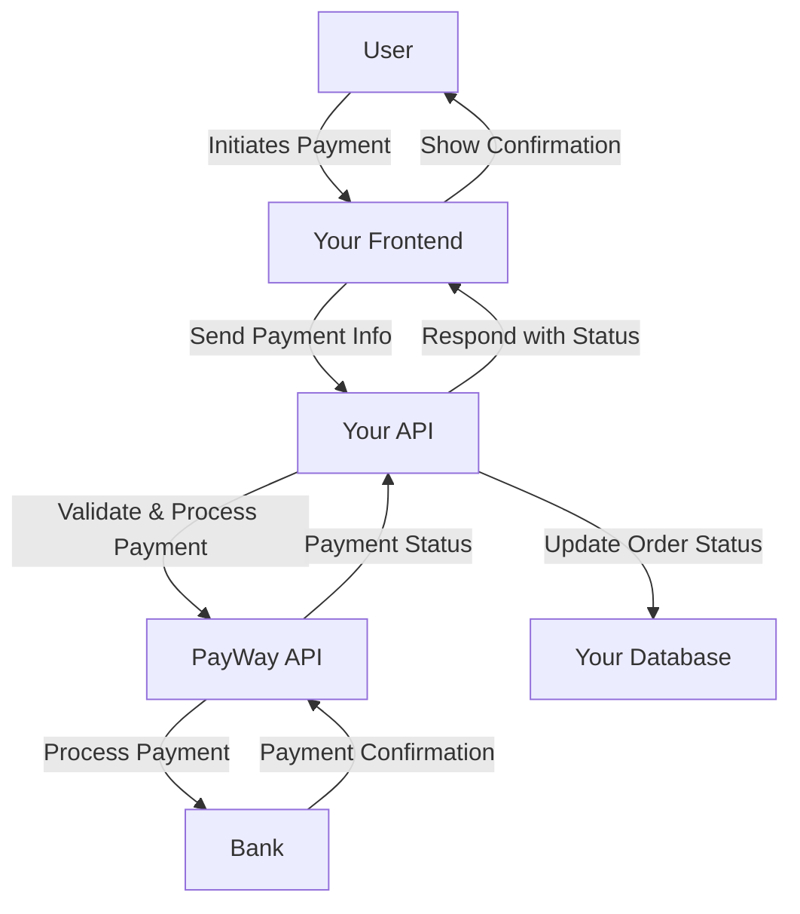
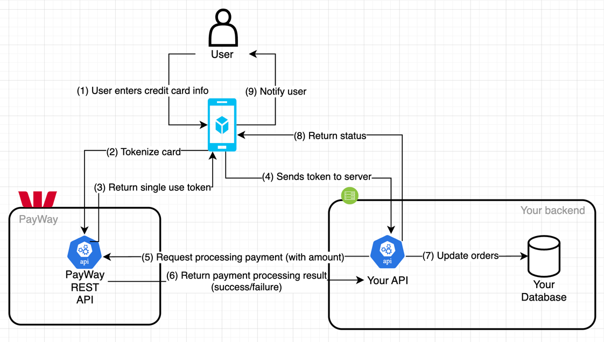
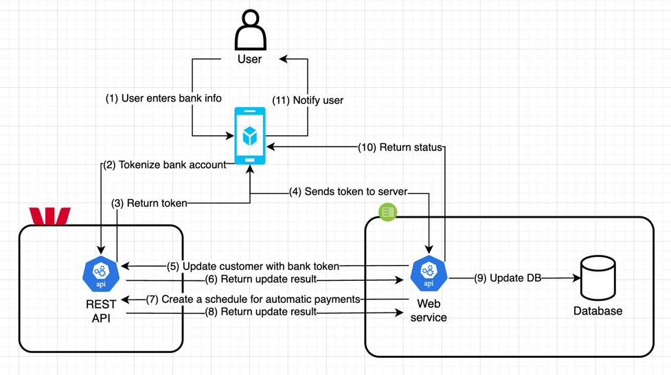

# Integrating PayWay Payment Gateway into Your Website or Application

Integrating a payment gateway into your website or app is a critical step 
for any business looking to accept online payments securely and efficiently. 
In this article, we will explore the process of integrating PayWay by Westpac, 
a popular payment gateway in Australia, into your website or app. 
We will discuss the technical aspects, compare it with other Australian payment solutions, 
and provide practical examples to help you get started.

## Understanding Payment Gateways: The Backbone of Online Transactions

At its core, a payment gateway acts as a bridge between your website/app and the financial institutions involved in processing transactions. 
It authorizes payments, ensures security, and manages the flow of funds.

## Choosing the Right Payment Gateway: Key Considerations

Selecting the right payment gateway is a critical decision for your business. Here are some factors to weigh:

- Security: Robust fraud prevention tools and compliance with industry standards (e.g., PCI DSS) are non-negotiable.
- Fees: Transaction fees, setup costs, and monthly charges can vary significantly.
- Supported Payment Methods: Ensure the gateway supports the payment methods your customers prefer (e.g., credit cards, direct debit).
- Integration Options: Look for a gateway with comprehensive APIs and SDKs to simplify the integration process.
- Customer Support: Reliable technical support is crucial in case of issues.

## Introduction to PayWay by Westpac

PayWay is a widely-used payment gateway in Australia, offering a range of benefits:

- Strong Security: PayWay is PCI DSS compliant and employs advanced fraud detection tools.
- Flexible Payment Options: It supports a wide array of payment methods, including credit cards, BPAY, and direct debit.
- Integration Capabilities: PayWay provides detailed documentation and APIs for seamless integration with various platforms.
- Local Support: As a Westpac product, PayWay offers dedicated Australian-based customer support.

## Integrating PayWay: Technical Overview

### System Architecture

Integrating PayWay into your website or app involves several components working 
together to process payments securely. Below is a proposed system architecture for integrating PayWay:



#### Payment Flow

The payment flow for integrating PayWay can be summarized in the following steps:

- User Initiates Payment: The user selects a product or service and initiates the payment process on the website or app.
- Send Payment Info: The frontend collects payment information from the user and sends it to the backend server.
- Request Payment: The backend server sends a payment request to the PayWay API with the necessary payment details.
- Process Payment: PayWay processes the payment through the bank.
- Payment Confirmation: The bank confirms the payment status to PayWay.
- Update Order Status: The backend server updates the order status based on the payment confirmation received from PayWay.
- Show Confirmation: The user receives a payment confirmation on the website or app.

## Practical Example: Integrating PayWay in Python

To demonstrate how to integrate PayWay into your application, 
we made a proof of concept (POC) code available on [our GitHub repo](https://github.com/whitefoxcloud/payway-poc). 

This POC provides examples for processing credit card and direct debit payments using PayWay.

The code implementations are for demonstration purposes only and should be adapted to your specific requirements and security standards.

### Credit Card Payment Example



Here is a simplified version of how to process a credit card payment using PayWay:

```python
import requests

PAYWAY_API_URL = "https://api.payway.com.au/rest/v1/transactions"
PAYWAY_SINGLE_USE_TOKEN_API_URL = "https://api.payway.com.au/rest/v1/single-use-tokens"
PAYWAY_PUBLISHABLE_API_KEY = ""  <-- This should be your publishable key
PAYWAY_SECRET_API_KEY = ""  <-- This should be your secret key


def process_credit_card_payment(amount, card_number, card_holder_name, expiry_month, expiry_year, cvn, merchant_id="TEST"):
    # Tokenize card information
    # Should be using payway.js with trusted frame to tokenize card information
    # or calling the single use token endpoint directly from your frontend using publishable key
    card_info_data = {
        "paymentMethod": "creditCard",
        "cardNumber": card_number,
        "cardholderName": card_holder_name,
        "cvn": cvn,
        "expiryDateMonth": expiry_month,
        "expiryDateYear": expiry_year,
    }
    tokenizing_response = requests.post(
        PAYWAY_SINGLE_USE_TOKEN_API_URL,
        data=card_info_data,
        headers={
            "Content-Type": "application/x-www-form-urlencoded",
        },
        auth=(PAYWAY_PUBLISHABLE_API_KEY, "")
    )
    token = tokenizing_response.json()["singleUseTokenId"]

    # Process payment
    payment_data = {
        "transactionType": "payment",
        "singleUseTokenId": token,
        "customerNumber": "your_customer_number",
        "principalAmount": amount,
        "currency": "aud",
        "merchantId": merchant_id,
    }

    response = requests.post(
        PAYWAY_API_URL,
        data=payment_data,
        headers={
            "Content-Type": "application/x-www-form-urlencoded",
        },
        auth=(PAYWAY_SECRET_API_KEY, "")
    )

    if response.status_code != 200:
        raise Exception("the payment was not successful")

    return response.json()


# Example usage
response = process_credit_card_payment(1000, "4111111111111111", "John Doe", "12", "25", "123")
print(response)
```

### Direct Debit Payment Example



Similarly, here is an example for processing a direct debit payment:

```python
from datetime import datetime

import requests

PAYWAY_API_URL = "https://api.payway.com.au/rest/v1/transactions"
PAYWAY_SINGLE_USE_TOKEN_API_URL = "https://api.payway.com.au/rest/v1/single-use-tokens"
PAYWAY_CUSTOMER_API_URL = "https://api.payway.com.au/rest/v1/customers/{customer_id}"
PAYWAY_REGULAR_PAYMENT_API_URL = "https://api.payway.com.au/rest/v1/customers/{customer_id}/schedule"
BANK_ID = "0000000A"
PAYWAY_PUBLISHABLE_API_KEY = ""  <-- This should be your publishable key
PAYWAY_SECRET_API_KEY = ""  <-- This should be your secret key


def process_direct_debit_payment(amount, frequency, bsb, account_number, account_name, customer_id, merchant_id="TEST"):
    # Tokenize card information
    # Should be using payway.js with trusted frame to tokenize card information
    # or calling the single use token endpoint directly from your frontend using publishable key
    card_info_data = {
        "paymentMethod": "bankAccount",
        "bsb": bsb,
        "accountNumber": account_number,
        "accountName": account_name,
    }
    tokenizing_response = requests.post(
        PAYWAY_SINGLE_USE_TOKEN_API_URL,
        data=card_info_data,
        headers={
            "Content-Type": "application/x-www-form-urlencoded",
        },
        auth=(PAYWAY_PUBLISHABLE_API_KEY, "")
    )
    token = tokenizing_response.json()["singleUseTokenId"]

    # Store the bank account to customer
    customer_data = {
        "singleUseTokenId": token,
        "merchantId": merchant_id,
        "bankAccountId": BANK_ID
    }
    customer_response = requests.put(
        PAYWAY_CUSTOMER_API_URL.format(customer_id=customer_id),
        data=customer_data,
        headers={
            "Content-Type": "application/x-www-form-urlencoded",
        },
        auth=(PAYWAY_SECRET_API_KEY, "")
    )


    # Set a schedule payment for the stored customer
    payment_data = {
        "frequency": frequency,
        "nextPaymentDate": datetime.today().strftime('%d %b %Y'),
        "regularPrincipalAmount": amount,
    }

    response = requests.put(
        PAYWAY_REGULAR_PAYMENT_API_URL.format(customer_id=customer_id),
        data=payment_data,
        headers={
            "Content-Type": "application/x-www-form-urlencoded",
        },
        auth=(PAYWAY_SECRET_API_KEY, "")
    )

    if response.status_code != 200:
        raise Exception("the payment was not successful")

    return response.json()


# Example usage
response = process_direct_debit_payment(1000, "weekly", "012003", "456789", "John Doe", "your_customer_number")
print(response)
```

### Settlement & Reconciliation

Settlement involves transferring funds from the customer’s bank account to the merchant’s account, 
typically through batch processing, clearing, and funding stages. Reconciliation ensures all 
transactions are accurately recorded, matching payment gateway records with bank statements to 
identify discrepancies such as failed transactions, chargebacks, or duplicate payments. 

For direct debit and credit card payments, common errors include insufficient funds, 
invalid details, or authorization failures. Handling these errors involves notifying 
customers promptly, retrying transactions if supported, and maintaining detailed records to resolve disputes effectively.

#### Handling errors
For direct debit, handle issues like insufficient funds by notifying customers and retrying payments. 

For credit card payments, ensure real-time validation and provide clear error messages 
for failures due to invalid or expired cards. Implement robust error handling and automated 
reconciliation tools to streamline the process, reducing manual errors and enhancing customer satisfaction. 

Regular monitoring and communication with customers about transaction statuses are crucial for 
maintaining trust and ensuring smooth payment processing.


## Example PayWay SDK

The codes we introduced above were the simplified version of how you could communicate with PayWay using Python's `requests` library. While this approach works, it requires manual handling of HTTP requests and responses, which can be error-prone and time-consuming.

The better approach is to implement an SDK. We've developed an example SDK client that abstracts away the complexities of direct API calls. Using SDK client, you can enjoy several benefits:
- **Ease of Use**: The SDK provides intuitive functions that simplify interactions with the PayWay API, reducing boilerplate code and making your codebase cleaner.
- **Improved Reliability**: Our SDK handles many common issues such as retries, error handling, and response parsing, ensuring more reliable and robust communication with the PayWay API.
- **Enhanced Security**: By managing authentication and secure data transmission within the SDK, we minimize potential security vulnerabilities in your application.

You can integrate this SDK into your project by visiting [our GitHub repo](https://github.com/whitefoxcloud/payway-poc/tree/main/src/payway). The repository includes comprehensive examples to help you get started quickly.


### SDK Usage Example: Credit Card Payment

Here's an example of how you can use our example PayWay SDK to process a credit card payment. 

Please note that this is for demonstration purposes only, and not an official SDK from PayWay, hence you should adapt it to your specific requirements and security standards.

Create a PayWay client instance:
```python
payway_client = PayWayClient(
    api_base_url="https://api.payway.com.au/rest/v1",
    merchant_id="TEST",
    bank_account_id="0000000A",
    publishable_api_key="YOUR_PUBLISHABLE_API_KEY",
    secret_api_key="YOUR_SECRET_API_KEY",
)
```

Obtain a single use token for a credit card:
```python
# Create a card instance
card = PayWayCard(
    card_number="4715142376126536",
    cvn="218",
    card_holder_name="Filippa Padovano",
    expiry_date_month="04",
    expiry_date_year="29"
)

# Create card token and create customer
token_response, errors = payway_client.create_card_token(card)
if errors:
    for error in errors:
        print(error.to_message())
        return
token = token_response.token

# Log card token
print("Created card token:", token)
```

Create a customer and store the card token:
```python
# Create a customer instance
customer = PayWayCustomer(
    custom_id="[YOUR_CUSTOMER_ID]",
    customer_name="John Doe",
    email_address="johndoe@whitefox.cloud",
    send_email_receipts=False,
    phone_number="0343232323",
    street="1 Test Street",
    street2="2 Test Street",
    city_name="Melbourne",
    state="VIC",
    postal_code="3000",
    token=token,
)

# Store the customer information with the card
payway_customer, errors = payway_client.create_customer(customer)
if errors:
    for error in errors:
        print(error.to_message())
        return
    
# Log customer creation information
print("Created customer:", payway_customer.customer_number)
```

Process a transaction:
```python
# Create a transaction instance
payment = PayWayPayment(
    customer_number=payway_customer.customer_number,
    transaction_type="payment",
    amount="YOUR_AMOUNT",
    currency="aud",
    order_number="YOUR_ORDER_NUMBER",
    ip_address=""
)

# Process the payment transaction
transaction, errors = payway_client.process_payment(payment)
if errors:
    for error in errors:
        print(error.to_message())
        return
    
# Log transaction information
print("Processed transaction:", transaction.transaction_id)
print("Transaction status:", transaction.status)
```

This example demonstrates how you can use the PayWay SDK to handle credit card payments in a more structured and secure manner.

You can get started using our example SDK code. If you need further assistance or customization, feel free to reach out to us. 
We can help you tailor the SDK to your specific requirements and ensure a seamless integration with PayWay.


# Comparing PayWay with Monoova, Stripe, and Other Australian Payment Gateways

| Feature                               | [PayWay](https://www.payway.com.au)                   | [Monoova](https://www.monoova.com)                                                | [Stripe](https://stripe.com/en-au)                   | [Zepto](https://www.zepto.com.au)                      | [Azupay](https://azupay.com)                              | [eWAY](https://www.eway.com.au)                      | [Braintree](https://www.braintreepayments.com/en-au) |
|---------------------------------------|----------------------------------|----------------------------------------------------------------|--------------------------------------|--------------------------|-------------------------|-------------------------|------------------------|
| Security                              | PCI DSS Compliant                | PCI DSS Compliant                                              | PCI DSS Compliant                    | PCI DSS Compliant        | PCI DSS Compliant       | PCI DSS Compliant       | PCI DSS Compliant      |
| Payment Methods                       | Credit cards, BPAY, Direct Debit | Credit cards, PayTo, Direct Debit, PayID, NPP                  | Credit cards, digital wallets, etc.  | PayID, NPP, Direct Debit | PayID, NPP               | Credit cards, PayPal | Credit cards, PayPal |
| Generating virtual accounts on-demand | Yes                              | Yes                                                            | No                                   | Yes                      | No                      | No                         | No                        |
| Integration                           | API, Hosted Page, etc.           | API, SDK                                                       | API, SDK, Pre-built UI               | API, SDK                 | API, SDK                | API, SDK                | API, SDK               |
| Customer Support                      | Australian-based                 | Australian-based                                               | Global, 24/7                         | Australian-based         | Australian-based        | Australian-based        | Global                 |
| Additional Features                   | Limited                          | Real-time payments, PayTo, automated reconciliation with PayID | Recurring billing, marketplace, etc. | Automated reconciliation | PayTo, Auto-matching transactions |                         |                        |

## Alternative solution: Monoova
While PayWay is a popular choice, it's important to consider alternatives like Monoova. 
Monoova is known for its focus on real-time payments and innovative features like PayTo.

### Security
- PayWay: Offers advanced encryption and is backed by Westpac's robust security infrastructure.
- Monoova: Also provides strong security measures, focusing on real-time payment processing.

### Payment Methods
- PayWay: Supports credit card and direct debit payments.
- Monoova: Specializes in real-time payments, including PayTo, PayID and NPP (New Payments Platform) payments.

### Virtual Accounts & PayID

#### Generating virtual accounts on-demand
Monoova allows generating virtual BSB and account numbers on-demand, providing flexibility for businesses to manage their payments.

#### PayID
PayID is a unique identifier that can be linked to a bank account, a feature that enables customers to make payments with easy-to-remember information. Instead of providing a BSB and account number, users can provide a simple identifier such as a phone number, email address, or ABN. This makes the payment process more convenient and secure.

With Monoova, you can generate/assign PayIDs and unique account numbers to every single one of your customers.

### Automated reconciliation
It offers automated reconciliation with PayID, which simplifies the process of matching incoming payments to invoices or customer accounts. This feature reduces the manual effort required for reconciliation, enhances accuracy, and helps in maintaining up-to-date financial records.


### Integration
PayWay: Offers comprehensive documentation and various integration options, making it suitable for a wide range of businesses.
Monoova: Provides APIs that are designed for seamless integration with modern financial systems.

### Pricing
PayWay: Pricing is based on transaction volume and payment methods used.
Monoova: Offers competitive pricing with a focus on high-volume, real-time transactions.


# Whitefox Expertise: Your Partner in Payment Gateway Integration

Integrating a payment gateway is a crucial step in transforming your website or app 
into a powerful sales channel. With a carefully chosen gateway and expert implementation, 
you can offer your customers a secure, convenient payment experience, 
leading to increased sales and customer satisfaction.

Navigating the technical complexities of payment gateway integration can be daunting. 
Whitefox  can guide you through the process, from selecting the optimal gateway to ensuring a seamless integration with proper testing.

If you need assistance with integration or have any questions, feel free to 
reach out to Whitefox.
