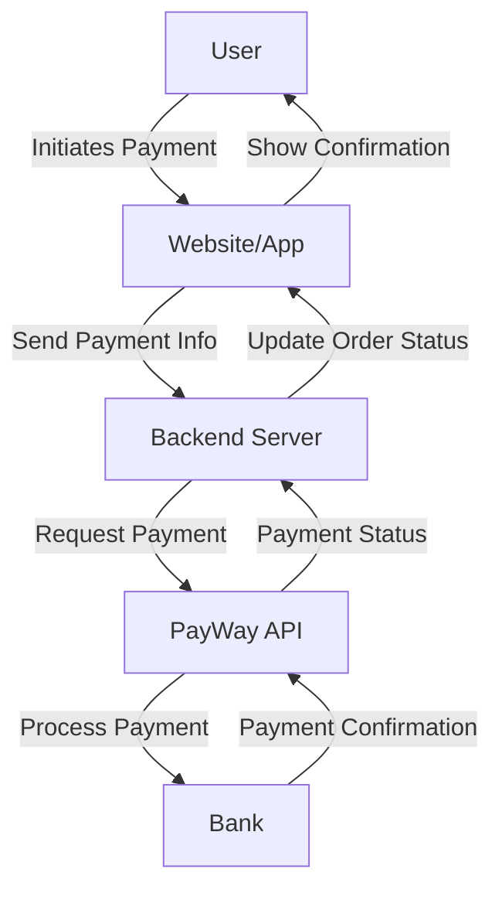

# Integrating Payment Gateway into Your Website/App: A Comprehensive Guide using PayWay 

Integrating a payment gateway into your website or app is a critical step 
for any business looking to accept online payments securely and efficiently. 
In this article, we will explore the process of integrating PayWay by Westpac, 
a popular payment gateway in Australia, into your website or app. 
We will discuss the technical aspects, compare it with other Australian payment solutions, 
and provide practical examples to help you get started.

## Understanding Payment Gateways: The Backbone of Online Transactions

At its core, a payment gateway acts as a bridge between your website/app and the financial institutions involved in processing transactions. 
It authorizes payments, ensures security, and manages the flow of funds.

## Choosing the Right Payment Gateway: Key Considerations

Selecting the right payment gateway is a critical decision for your business. Here are some factors to weigh:

- Security: Robust fraud prevention tools and compliance with industry standards (e.g., PCI DSS) are non-negotiable.
- Fees: Transaction fees, setup costs, and monthly charges can vary significantly.
- Supported Payment Methods: Ensure the gateway supports the payment methods your customers prefer (e.g., credit cards, direct debit).
- Integration Options: Look for a gateway with comprehensive APIs and SDKs to simplify the integration process.
- Customer Support: Reliable technical support is crucial in case of issues.

## Introduction to PayWay by Westpac

PayWay is a widely-used payment gateway in Australia, offering a range of benefits:

- Strong Security: PayWay is PCI DSS compliant and employs advanced fraud detection tools.
- Flexible Payment Options: It supports a wide array of payment methods, including credit cards, BPAY, and direct debit.
- Integration Capabilities: PayWay provides detailed documentation and APIs for seamless integration with various platforms.
- Local Support: As a Westpac product, PayWay offers dedicated Australian-based customer support.

## Integrating PayWay: Technical Overview

### System Architecture

Integrating PayWay into your website or app involves several components working 
together to process payments securely. Below is a proposed system architecture for integrating PayWay:



#### Payment Flow

The payment flow for integrating PayWay can be summarized in the following steps:

- User Initiates Payment: The user selects a product or service and initiates the payment process on the website or app.
- Send Payment Info: The frontend collects payment information from the user and sends it to the backend server.
- Request Payment: The backend server sends a payment request to the PayWay API with the necessary payment details.
- Process Payment: PayWay processes the payment through the bank.
- Payment Confirmation: The bank confirms the payment status to PayWay.
- Update Order Status: The backend server updates the order status based on the payment confirmation received from PayWay.
- Show Confirmation: The user receives a payment confirmation on the website or app.

## Practical Example: Integrating PayWay in Python

To demonstrate how to integrate PayWay into your application, 
we made a proof of concept (POC) code available on [our GitHub repo](https://github.com/whitefoxcloud/payway-poc). 
This POC provides examples for processing credit card and direct debit payments using PayWay.

### Credit Card Payment Example

Here is a simplified version of how to process a credit card payment using PayWay:

```python
import requests

PAYWAY_API_URL = 'https://api.payway.com.au/rest/v1/transactions'
PAYWAY_API_KEY = 'your_api_key'

def process_credit_card_payment(amount, card_number, expiry_month, expiry_year, cvv):
    headers = {
        'Authorization': f'Bearer {PAYWAY_API_KEY}',
        'Content-Type': 'application/json',
    }
    
    data = {
        'amount': amount,
        'currency': 'AUD',
        'paymentMethod': {
            'type': 'creditCard',
            'cardNumber': card_number,
            'expiryMonth': expiry_month,
            'expiryYear': expiry_year,
            'cvv': cvv,
        },
    }
    
    response = requests.post(PAYWAY_API_URL, json=data, headers=headers)
    return response.json()

# Example usage
response = process_credit_card_payment(1000, '4111111111111111', '12', '25', '123')
print(response)
```

### Direct Debit Payment Example

Similarly, here is an example for processing a direct debit payment:

```python
import requests

PAYWAY_API_URL = 'https://api.payway.com.au/rest/v1/transactions'
PAYWAY_API_KEY = 'your_api_key'

def process_direct_debit_payment(amount, account_name, bsb, account_number):
    headers = {
        'Authorization': f'Bearer {PAYWAY_API_KEY}',
        'Content-Type': 'application/json',
    }
    
    data = {
        'amount': amount,
        'currency': 'AUD',
        'paymentMethod': {
            'type': 'directDebit',
            'accountName': account_name,
            'bsb': bsb,
            'accountNumber': account_number,
        },
    }
    
    response = requests.post(PAYWAY_API_URL, json=data, headers=headers)
    return response.json()

# Example usage
response = process_direct_debit_payment(1000, 'John Doe', '123456', '987654321')
print(response)
```

### Example PayWay SDK

You could refer to the simple SDK that we implemented in [our GitHub repo](https://github.com/whitefoxcloud/payway-poc).

That includes the skeleton of the SDK for communicating with PayWay API. 

If you want to modify and adapt it to your specific business needs or get help with integrating PayWay into your system, we could help you. Feel free to contact us.


# Comparing PayWay with Monoova, Stripe, and Other Australian Payment Gateways

| Feature            | PayWay            | Monoova           | Stripe            | eWAY       | Braintree |
|--------------------|--------------------|--------------------|--------------------|------------|-----------|
| Security           | PCI DSS Compliant | PCI DSS Compliant | PCI DSS Compliant | PCI DSS Compliant | PCI DSS Compliant |
| Payment Methods    | Credit cards, BPAY, Direct Debit | Credit cards, PayTo, Direct Debit | Credit cards, digital wallets, etc. | Credit cards, PayPal, etc. | Credit cards, PayPal, etc. |
| Integration        | API, Hosted Page, etc. | API, SDK         | API, SDK, Pre-built UI | API, SDK    | API, SDK   |
| Customer Support  | Australian-based | Australian-based | Global, 24/7       | Australian-based | Global     |
| Additional Features| Limited            | Real-time payments, PayTo | Recurring billing, marketplace, etc. | Fraud prevention, etc. | Fraud prevention, etc. |


## Alternative solution: Monova
While PayWay is a popular choice, it's important to consider alternatives like Monoova. 
Monoova is known for its focus on real-time payments and innovative features like PayTo.

### Security
PayWay: Offers advanced encryption and is backed by Westpac's robust security infrastructure.
Monoova: Also provides strong security measures, focusing on real-time payment processing.

### Payment Methods
PayWay: Supports credit card and direct debit payments.
Monoova: Specializes in real-time payments, including PayTo and NPP (New Payments Platform) payments.

### Integration
PayWay: Offers comprehensive documentation and various integration options, making it suitable for a wide range of businesses.
Monoova: Provides APIs that are designed for seamless integration with modern financial systems.

### Pricing
PayWay: Pricing is based on transaction volume and payment methods used.
Monoova: Offers competitive pricing with a focus on high-volume, real-time transactions.


# Whitefox Expertise: Your Partner in Payment Gateway Integration

Integrating a payment gateway is a crucial step in transforming your website or app 
into a powerful sales channel. With a carefully chosen gateway and expert implementation, 
you can offer your customers a secure, convenient payment experience, 
leading to increased sales and customer satisfaction.

Navigating the technical complexities of payment gateway integration can be daunting. 
Whitefox  can guide you through the process, from selecting the optimal gateway to ensuring a seamless integration with proper testing.

If you need assistance with integration or have any questions, feel free to 
reach out to Whitefox.